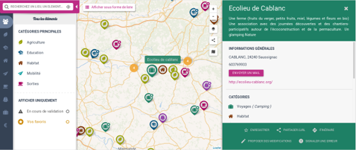
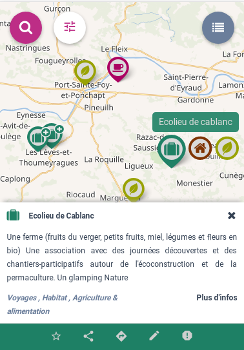

GoGoCartoJs
==========
A javascript component to create terrific cartography !


.   .   

Overview
--------

GoGoCartoJs is fast, ergonomic, responsive and fully configurable. 

It can be instanciated in few lines from a DOM element, a taxonomy (i.e. filters/categories) and a dataset (distant or local). Both taxonomy and data need to be JSON objects.

```javascript
carto = goGoCarto('#gogocarto', {
  data: {
      taxonomy: "http://test.com/api/taxonomy",
      elementsApiUrl: 'https://test.com/api/dataset'
  });
```

Know more about [Usage](docs/usage.md), [Features](docs/features.md) and [Configuration](docs/confiiguration.md)


Stack
-----
Typescript, Nunjucks templates, Leaflet, SASS, MaterializeCSS, Gulp


Want to Contribute ?
-------------

- [Installation intructions](docs/installation.md)
- [Coding conventions](docs/coding-conventions.md)
- [Code Explanations](docs/code-explanations.md)
