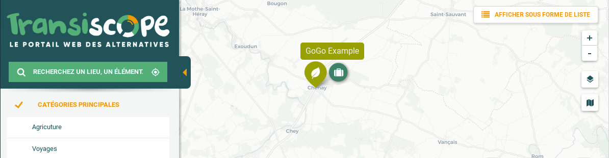
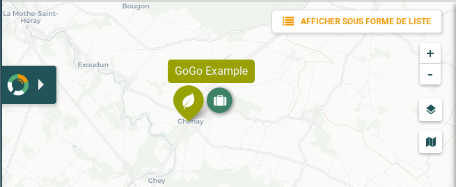
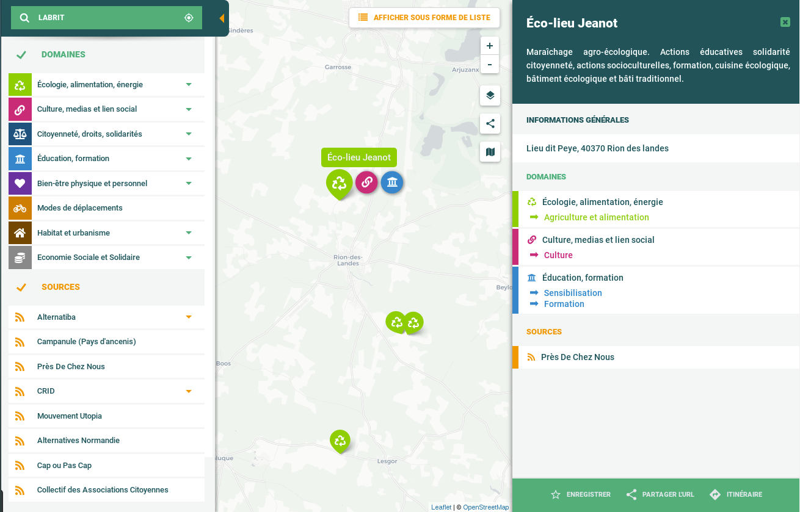

GoGoConfig
========

GoGoCarto is higly configurable, let's discover all the configurations options

Data
---
See [Taxonomy](taxonomy.md) and [Dataset](dataset.md) documentation.

```javascript
"data": {
  "taxonomy": "https://pixelhumain.github.io/GoGoCartoJs/web/data/taxonomy.json",
  "elements": "https://pixelhumain.github.io/GoGoCartoJs/web/data/elements.json",
  "requestByBounds": false
},
```

Menu
----
```javascript
"menu": {
  "width": 450,
  "smallWidthStyle": false
  "showOnePanePerMainOption": false,
  "showCheckboxForMainFilterPane": true, // you can hide the checkboxes for a lighter design
  "showCheckboxForSubFilterPane": true,
  "displayNumberOfElementForEachCategory": false,
  "displayNumberOfElementRoundResults": false // display 300+ instead of 325
},
```
You can custom the menu **width** (in pixel)

If your taxonomy is complex, you should better use the option **showOnePanePerMainOption**
It will add a vertical side bar with all the main option icons. clicking each main option icon will show a diferent pane
for each main option children.

[Check OneFilterPanePerMainOption Demo](https://pixelhumain.github.io/GoGoCartoJs/web/examples/index-full-taxonomy.html#/carte/@45.94,-0.38,10z?cat=all)

Set **smallWidthStyle** to false to use smaller font size and margins, so the taxonomy fit better into the fixed width

**displayNumberOfElementForEachCategory** Will add a label next to each category to display how many elements on the current viewport have this category
Use **displayNumberOfElementRoundResults** to round the results (display 300+ instead of 325)

General
------
```javascript
"general": {
    "activateHistoryStateAndRouting": true
  }
```
If **activateHistoryStateAndRouting** is true, every action on GoGoCarto will update the url hash, and an history will be created.
It means you can refresh the page anytime and you will keep the same state. You can use the browser "back" function to go to the previous action

Example : http://gogocarto.fr#/fiche/Element-example/10m9/@46.662,-1.110,12z?cat=Education

Infobar
------
InfoBar is the panel to display element informations, opened on marker click
```javascript
"infobar": {
    "width": 520,
    "activate": true,
    "bodyTemplate": {
      "content": "http://localhost/GoGoCartoJs/web/data/body-template.md",
      "isMarkdown": true,
      "type": "url"
    },
    "headerTemplate": {
      "content": "{{ description|gogo_textarea }}",
      "isMarkdown": false,
      "type": "string"
    }
  }
```

Custom **width** in pixel

If **activate** is set to false, nothing happens on marker click, the info bar is not displayed

Custom **bodyTemplate** and **headerTemplate** of an element can be provided. See [Info Bar Templates](info-bar-templates.md) to learn how to build a template.
An object need to be given with the following options:
  * **content** is a string containing inline template, or an url to a template file.
  * **isMardown** is set to true, if the content given uses Markdown syntax, false otherwise.
  * **type** must be set to "url", if the content is remote, or "string" so the content is used as is.

Marker
------
```javascript
"marker": {
    "displayPopup": true,
    "popupAlwaysVisible": false,
    "popupTemplate": {
      "content": "Hi {{ name }} !",
      "isMarkdown": false,
      "type": "string"
    },
  }
```
When activated, the popup is a content displayed on top of the marker, by default only when mouse hover the marker
Same as `InfoBar` templates, you can customize the popup when mouse hover a marker. by default this popup display the name of the element

Internationalization
------
Choose the language (only french and english for now), and overwrite any translation if desired
```javascript
"language": "en",
"translations": { // used this property to overwrite any translation
  "show.as.list": "Display List View", // will use "Display List View" instead of default "Show as List"
}
```
A common use case is to overwrite the way we call an "element". For exemple if I'm collecting data about NGO organisations, I will better display "choose an organisation" instead of "choose an element". Here are the translations keys to overwrite
```javascript
"translations": {
  "element": "organisation",
  "element.definite": "the organisation",
  "element.indefinite": "an organisation",
  "element.plural": "organisations"
  }
```
If you want to translate GoGoCartoJs for a new language, your help will be very appreciated! Please contact the developer team if you don't know how to do it.

Map
------
```javascript
"map": {
  "defaultBounds": {
    "_southWest": { "lat": 40, "lng": -5 },
    "_northEast": { "lat": 52, "lng": 10 }
  },
  "defaultCenter": { "lat": 46, "lng": 0 },
  "maxBounds": {
    "_southWest": { "lat": -90, "lng": -180 },
    "_northEast": { "lat": 90, "lng": 180 }
  },
  "useClusters": true,
  "saveViewportInCookies": false,
  "saveTileLayerInCookies": false,
  "defaultTileLayer": "cartodb",
  "tileLayers": [
    {
      "name": "cartodb",
      "url": "https://cartodb-basemaps-{s}.global.ssl.fastly.net/light_all/{z}/{x}/{y}.png",
      "attribution": "© <a href="https://www.openstreetmap.org/copyright">OpenStreetMap contributors</a>"
    },
    {
      "name": "wikimedia",
      "url": "https://maps.wikimedia.org/osm-intl/{z}/{x}/{y}.png",
      "attribution": "© <a href="https://www.openstreetmap.org/copyright">OpenStreetMap contributors</a>"
    },
  ]
},
```
**DefaultBounds** and **DefautCenter** are used for the initial map state.
**MaxBounds** is used to prevent loading elements outside of this bounds
**useClusters** a cluster is when we group at least 4 marker into a single object displayed on the map

Features
------
Please visit [Features Documentation](features.md) to discover in detail the features.

```javascript
"features": {
  // buttons added to the element info bar menu
  "favorite": // save an element as favotite (using cookies)
  "share": // get the element url inside gogocarto
  "directions": // calculate routing towards the element position
  "edit": // Open the given edit page in a new tab
  "delete": // Open a popup dialog and send delete request to your server
  "report":  // Open a report dialog and send a report request to your server

  "sendMail": // send an mail to an Element

  "listMode": // access to list mode

  "export": // popup to get the iframe code of the current map
  "layers": // choose different tile layer for the map
  "mapdefaultview": // restore viewport to default viewport

  "searchPlace": // Allow search for a place
  "searchElements": // Allow search for elements (needs a distant API)
  "searchGeolocate": // Add geolocation button to geolocate the user position

  "customPopup": // Display a custom text on the bottom of the map
},
```

If you don't provide any features config, a default set of basic config will be loaded.
If you provide a features config, only the features listed in it will be available. To simply activate a feature, just add it on the list
```javascript
"features": {
  "favorite": {}, // give empty object to activate the feature with default config
  "listMode": {}
}
```

All the features can be configured with the following attributes
```javascript
"roles" : string[] = ['anonymous', 'anonymous_with_mail', 'user', 'admin'];
"url": ""
"inIframe": default true
```
**roles** : an array of the role who can access this feature. you can use your own roles names, for example ['anonymous', 'user', 'admin'].
**url** : the following features need an URL to an API to work : edit, report, delete, sendMail, searchElements
**inIframe** activate or not the feature when gogocarto is loaded in iframe

Here an example of full custom features configuration
```javascript
"features":
{
  listMode: {},
  searchPlace: { },
  searchGeolocate: {},
  searchElements:   {
      url: 'http://localhost/GoGoCarto/web/app_dev.php/api/elements/search'
  },
  delete:   {
      url: 'http://localhost/GoGoCarto/web/app_dev.php/interact/delete',
      roles: ['admin'], inIframe: false
  },
  report:   {
      url: 'http://localhost/GoGoCarto/web/app_dev.php/interact/report',
      roles: ['anonymous', 'user']
  },
  edit:     { url: 'http://localhost/GoGoCarto/web/app_dev.php/elements/edit/' },
  sendMail: { url: 'http://localhost/GoGoCarto/web/app_dev.php/interact/sendMail' },
  favorite: { inIframe: false },
  directions: { },
  export:   { inIframe: false },
  share: { },
  layers: { },
  mapdefaultview: { },
  customPopup: {
    inIframe: false,
    options: {
      text: "Hello ! this is some custom text",
      showOnlyOnce: true, // If user click "close" the popup will never show again
      id: 4, // bump this id everytime you want the showOnlyOnce to be reseted
    }
  },
},
```

Security
------
```javascript
"security": {
  "userRoles": ["user"], // other examples : ["ROLE_ADMIN", "ROLE_USER"]
  "userEmail": "test@gt.gt"
},
```
**userRoles** is used to know if the current user has access to different features.
**userEmail** is used to prefill some interaction modals, like "report error", or "send mail".
To set dynamically **userRole** and **userEmail**, please check [How to interact with Component](usage.md)

Images
------
```javascript
images: {
  menuTopImage: "http://url/to/image",
  buttonOpenMenu: "http://url/to/image"
}
```
MenuTopImage



buttonOpenMenu



Theme
------
```javascript
"theme": "transiscope",
```
For now only two exists : the default one and "transiscope" :




Colors
------
```javascript
"colors": {
  "neutralDark": "#354254",
  "neutralDarkTransparent": "rgba(53, 66, 84, 0.9)",
  "neutralSoftDark": "#5c6c86",
  "neutral": "#6b7e9b",
  "neutralLight": "#f4f4f4",
  "secondary": "#bdc900",
  "primary": "#bd2d86",
  "background": "#f4f4f4",
  "textColor": "#354254",
  "disableColor": "#c2c9d4",
  "listTitle": "#bd2d86", // the title header on top of list view
  "listTitleBackBtn": "#354254",
  "listTitleBackground": "#f4f4f4",
  "mainFont": "Roboto",
  "titleFont": "Lobster",
  "taxonomyMainTitleFont": "Lobster"
}
```
If you want to use custom font (such as "Lobster"), don't forget to load this font with an external file !

