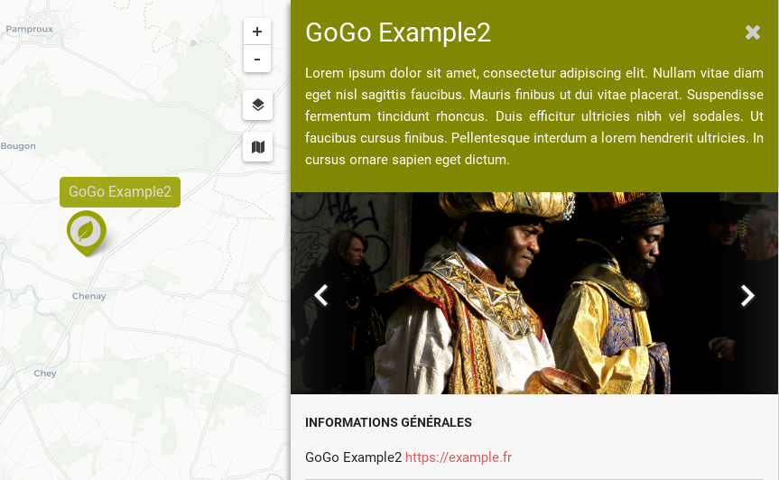
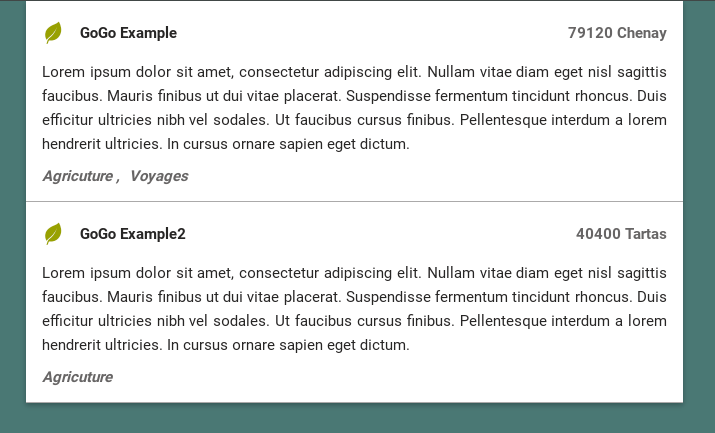

Element Configuration
========
For GoGoCarto to work properly, you need to provide at least 3 informations per element
* A **title**
* A **position** (latitude, longitude)
* A set of categories filled by the element (= **taxonomy**). It must be an array of Ids. The Ids can be number or string. Those Ids must be the same than the one given in the [Taxonomy](taxonomy.md) dataset

GoGoCarto will try to find those informations in the following attributes
* title / name
* latitude / lat / geo.latitude
* longitude / lng / long / geo.longitude
* taxonomy / categories

So both following examples will work the same


```javascript
{
  "title": "GoGo Example",
  "geo": {
    "latitude":46.3252,
    "longitude":-0.0339
  },
  "taxonomy": [ 10427, 'Market' ],
}

{
  "name": "GoGo Example",
  "lat": 46.3252,
  "lng": -0.0339,,
  "categories": [ 10427, 'Market' ],
}
```

Uppon those mandatory attributes, you can use any attributes. See [Info Bar Template](info-bar-templates.md) to learn how to display them in the InfoBar

Specific Attributes
=============

Be careful that some attributes names are reserved and have specifc behaviour

**Id**

The unique Id of each element. Can number or string, and is automatically generated if you do not provide one.

**Image or Images**

Url to an image (or array of url) that will be diplayed in the element info bar



**Address**

If provide an address with the following structure, postalCode and addresLocality will be used in the List mode to display an overview of the location.
```
 "address": {
    "streetAddress":"5 rue Edmond Proust",
    "addressLocality":"Chenay",
    "postalCode":"79120",
    "addressCountry":"FR",
    "customFormatedAddress": "Immeuble 4B, 5 Edmond Proust à Chenay, France"
 },
 ```

 


