Features
=====

Here a quick overview of GoGoCarto Features

List Mode
------

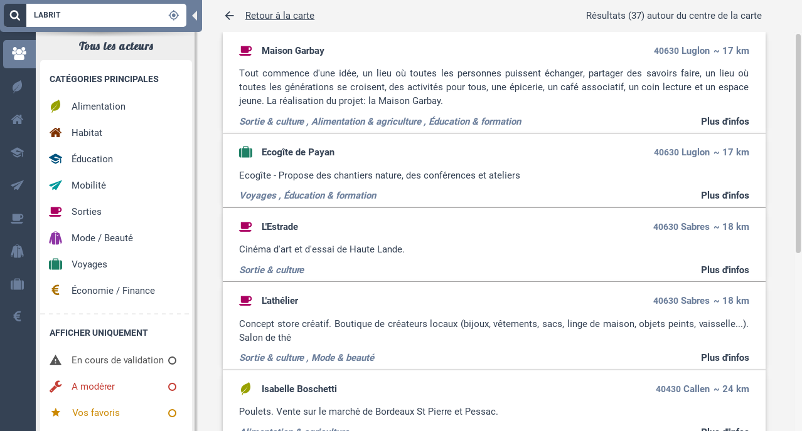
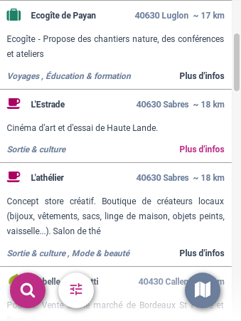

Search
------

Three search : search a place, search an elements, and geolocate

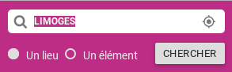

Map Controls
=========

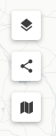

Change Tile Layers
-----

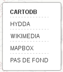

Export an iframe
-----

Reset map to initial viewport
------

Elements Actions
===========

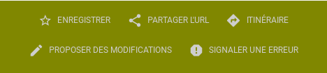

Save your favorites elements
-----

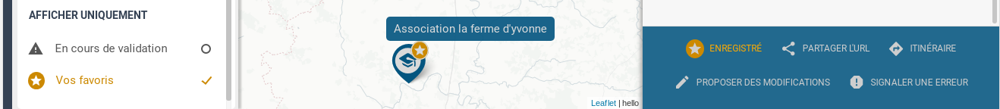

Share Element Url
-----

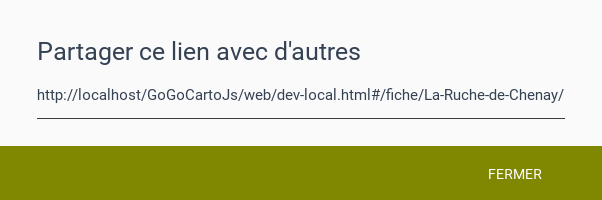

Directions
-----

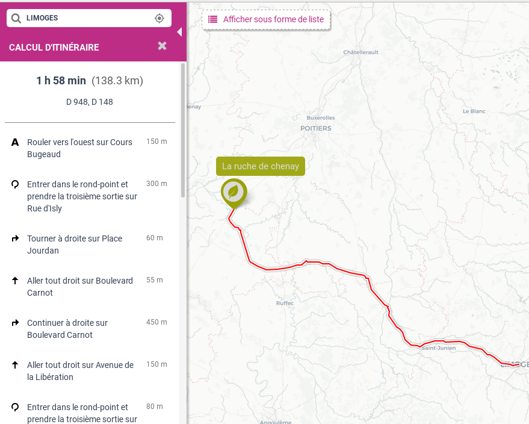

Edit (open edit url in a new tab)
-----

Report an error for an element (send via API)
-----

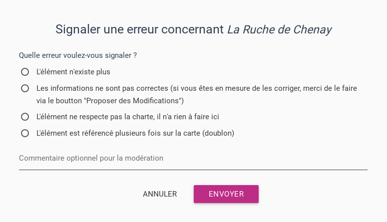

Delete an element (send via API)
-----

Send Mail via Button
-----

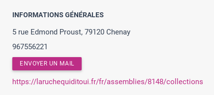
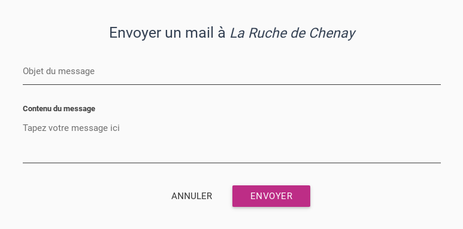
