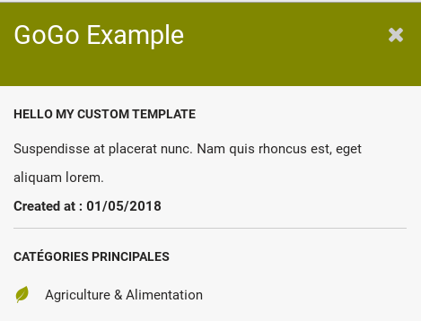
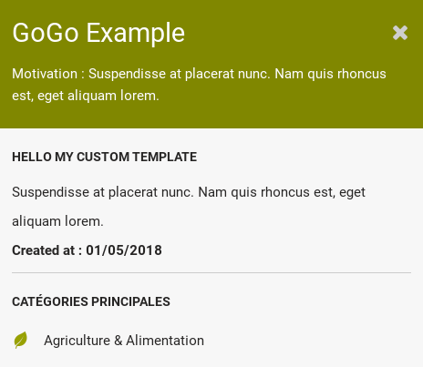
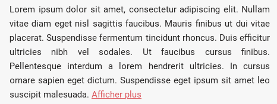
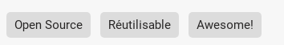

Info Bar Templates
===============

A template allow you to customize the rendering of the Info Bar. 

Templates can use [Markdown syntax](https://commonmark.org/help/) and/or a [Nunjucks syntax](https://mozilla.github.io/nunjucks/templating.html).
Templates can access all the attributes of an element with the syntax {{ myAttribute }}


Examples
------

Given this element

```javascript
{
  // Mandatory fields
  "title": "GoGo Example",
  "geo": {
    "latitude":46.3252,
    "longitude":-0.0339
  },
  "taxonomy": [ 10427, 'Market' ],

  // Custom fields (can be any)
  "createdAt": "01/05/2018",
  "motivation": "Suspendisse at placerat nunc. Nam quis rhoncus est, eget aliquam lorem."
}
```

If I do not provide a custom template, then the result will be


Not very satisfying ! It is just using the title and the taxonomy attributes. So we will now use this custom body template

```
## Hello my custom template

{{ motivation }}

**Created at : {{ createdAt }}**
___________

{{ taxonomy|gogo_taxonomy }}
```


You can see that I used some mardown syntax (heading, bold, and horizontal rule) and also I used the Nunjuck syntax for variables {{ myAttribute }}.
For the attribute taxonomy, I used a special filter called "gogo_taxonomy", see list of filters below.

How to provide custom template to the configuration
-----------------------

From the above example, there is three options

**Option 1** : inline
```javascript
"infobar": {
    "bodyTemplate": {
      "content": "## Hello my custom template\n{{ motivation }}\n**Created at : {{ createdAt }}**\n_________\n{{ taxonomy|gogo_taxonomy}}",
    },
  }
```

**Option 2** : string array
```javascript
"infobar": {
    "bodyTemplate": {
      "content": [
        "## Hello my custom template",
        "{{ motivation }}",
        "",
        "**Created at : {{ createdAt }}**",
        "____________",
        "{{ taxonomy|gogo_taxonomy}}"
      ]
    }
  }
```

**Option 3** : file
```javascript
"infobar": {
    "bodyTemplate": { 
      "content": "http://path/to/custom-element-body-template.md",
      type: "url"
    },
  }
```

Header Template
----------

You can also customize the header template, for example

```javascript
"infobar": {
    "headerTemplate": {
      "content": "Motivation : {{ motivation }}"
    }
    "bodyTemplate": { 
      "content": "http://path/to/custom-element-body-template.md",
      "type": "url"
    },
  }
```




Filters
-------

Nunjucks come with some builtin filters, see [Documentation](https://mozilla.github.io/nunjucks/templating.html#builtin-filters)

GoGoCarto has also some custom filters

**gogo_taxonomy** Use it with the taxonomy atribute `{{ taxonomy|gogo_taxonomy}}`

**gogo_textarea(truncate = 400)** This is used to display long text. There is an optional parameter called truncate which truncate the texte around the given character length and add a "display more" button 

```
{{ motivation|gogo_textarea(truncate = 400) }}
```



**gogo_url** Display urls

**gogo_email** Depending on configuration, it can hide the email and display a "Send Mail" button instead

**gogo_tags** display an array attributes 
```javascript
{
  // ...
  "blop": ["Open Source", "Réutilisable", "Awesome!"]
}
```
```
{{ blop|gogo_tags }}
```


