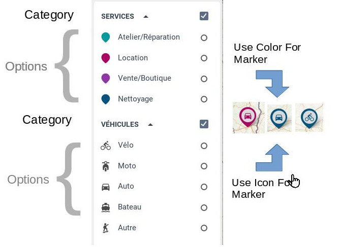
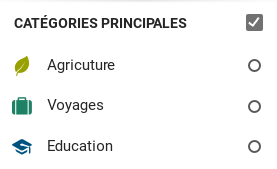

Advanced Taxonomy
============

Using Categories
---------------

A category is a container for grouping options.

.



In this example, we have 2 categories : Services and Véhicules. Each categorie have sub-options. The taxonomy json is

```javascript
{
  "subcategories":[
    {
      // Category "Services", used for coloring the marker, but not for the icon
      "name":"Services",
      "options":[
        { "name":"Atelier/Réparation", "color":"#009a9c" },
        { "name":"Location",           "color":"#ab0061" },
        { "name":"Vente/Boutique",     "color":"#8e36a5" },
        { "name":"Nettoyage",          "color":"#00537e" }
      ]
    },
    {
      // Category "Services", used for icons
      "name":"Véhicules",
      "options":[
        { "name":"Vélo",   "icon":"icon-bike" },
        { "name":"Moto",   "icon":"icon-moto" },
        { "name":"Auto",   "icon":"icon-car" },
        { "name":"Bateau", "icon":"icon-boat" },
        { "name":"Autre",  "icon":"icon-skate" }
      ]
    }
  ]
}
```

We can see that the options of the first category "Services" are used to choose the color of the marker. The second category is used to choose the icon of the marker.

[View Demo](https://pixelhumain.github.io/GoGoCartoJs/web/examples/index-multiple-categories.html#/carte/@46.59,7.83,6z?cat=all)


Full Category Configuration
----------------------

```javascript
{
  "name":"Category Name",
  "displayCategoryName": default true, // display or not the category in the filters tree
  "showExpanded" : default true, // show suboption or subcategories in inistial state
  "unexpandable" : default false, // do not permit the category to be expanded/unexpanded
  "enableDescription": default false, 
  "options": [], // Array of sub options
  "subcategories":[] // Array of sub categories. This filed is ignored when sub options are provided
}
```

**enableDescription** : See [Dataset configuration](dataset.md). An Element have many OptionValues which link it to existing options. An OptionValue can have a description, to describe how the element filled the option. When enableDescription is true, we display this description in the element info bar.

Complete Taxonomy
----------------

A category have multiple options, and an option can have multiple categories.
But a category can also have subcategories, and an option can have suboptions.

This ensure you to make all the possibles combinations.

The first node of a taxonomy is always a category. So instead of :

```javascript
{
  "options":[
    { "name":"Agriculture", "color":"#98A100", "icon":"icon-leaf-1" },    
    { "name":"Voyages", "color":"#1E8065", "icon":"icon-case" },
    { "name":"Education", "color":"#00537E", "icon":"icon-education-1" }
  ]  
}
```


We could add some configuration to the main Node

```javascript
{
  "name": "Main Categories"
  "enableDescription": true,
  "unexpanded": true,
  "options":[
    { "name":"Agriculture", "color":"#98A100", "icon":"icon-leaf-1" },    
    { "name":"Voyages", "color":"#1E8065", "icon":"icon-case" },
    { "name":"Education", "color":"#00537E", "icon":"icon-education-1" }
  ]  
}
```




