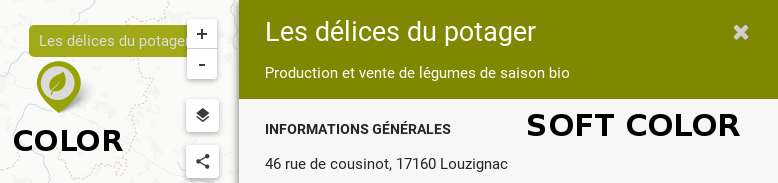
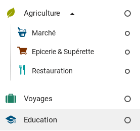

Configure an Option
==================

Here is a full configuration for an option

```javascript
{
  "id":10429,
  "name":"Education & Formation",
  "nameShort":"Education", 
  "color":"#7E3200",
  "softColor":"#864C26", 
  "icon":"icon-epicerie",
  "textHelper":"Organizations involved in new type of education",
  "showExpanded": false, // default false
  "displayOption": true, // default true
  "useIconForMarker": false,
  "useColorForMarker": false,
  "suboptions": [],
  "subcategories": [],
}
```

Name
----
Name of the option

NameShort
--------
If the option name is long, better provide a shorter name wich will be used were there is not a lot of space (in the menu for example). NameShort is by default equals to the Option Name

Id
--

An element displayed on the map must be linked to many options with the "optionValues" attributes (see [Dataset documentation](dataset.md)). Those options must be identified with an ID. It can be a number or a string.

For example
```optionsValues: [12, 45, 46]``` or
```optionsValues: ['Education', 'Formation']```

If you don't provide an ID in the option confiuguration, the "nameShort" attribute is used (and if no "nameShort", the "name")

Example
```javascript
element = {
  name: "Foo",
  optionsValues: ['Education', 42, 'Agriculture']
}

taxonomy = {
  options: [
    { name: "Education & Formation", nameShort: "Education" }
    { name: "Mobility", id: 42 }
    { name: "Agriculture" }
  ]
}
```

Color
-----
A string like "#fff", "#0245FF", "cyan"
Color is used to color the icon and the marker in most of the cases

SoftColor
---------
The SoftColor is used in the element-section. Oftenly we should use a softer color for this section, otherwise it's painfull for the eyes



Text Helper
----------
Display a text helper on option hover


Show Expanded
-------------
Whether or not the suboptions or subcategories should be visible on the initialized position




Display Option
--------------
If false, hide the option from the filter tree, but still show its children. Useful when we have complexes options tree and we want to simplify some hierchicals inclusions

Use Icon For Marker & Use Color For Marker
------------------------------------------
By default, if a icon is provided, the marker will use the option icon
By default, if a color is provided, the marker will use the option color

The icon & color for a marker is choosed with the deepest options in the tree. For example, given this taxonomy

```javascript
{
  "name":"Agriculture",
  "color":"green",
  "icon":"icon-leaf",
  "suboptions":[
    { "name":"Marché",       "color":"blue", "icon":"icon-marche" },
    { "name":"Epicerie",                     "icon":"icon-epicerie" },
    { "name":"Restauration", "color":"cyan" },
  ]
}
```
Markers will be displayed as follow 

| Option of the element | Marker Color | Marker Icon	|
|:--	|:--	|:--	|
| Marché 	| blue	| icon-marche	|
| Epicerie 	| green (parent color) | icon-epicerie 	|
| Restauration| cyan | icon-leaf (parent icon)	|

In some more complicate case, we want to prevent the marker to use the color or the icon of an option, the useIconForMarker and useColorForMarker are here for that.

```javascript
{
  "name":"Agriculture",
  "color":"green",
  "icon":"icon-leaf",
  "suboptions":[
    { "name":"Marché",       "color":"blue", useColorForMarker: false },
    { "name":"Epicerie",     "color":"grey", useColorForMarker: false },
    { "name":"Restauration", "color":"cyan", useColorForMarker: false },
  ]
}
```
Alls the marker will use the "green" color (picken from parent option agriculture)

Suboptions
----------
An array containnig the suboptions

Sucategories
------------
An array containing subcategories. If subcategories are provided, suboptions are ignored
