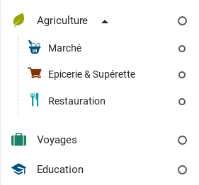

Simple Taxonomy
----------------

Let's see a basic option tree, with three options :

```javascript
{
  "options":[
    {
      "name":"Agriculture & Alimentation",
      "color":"#98A100",
      "icon":"icon-leaf-1"
    },    
    {
      "name":"Voyages",
      "color":"#1E8065",
      "icon":"icon-case"
    },
    {
      "name":"Education",
      "color":"#00537E",
      "icon":"icon-education-1"
    }
  ]  
}
```


Now we can add suboptions to first option

```json
"options":[
    {
      "name":"Agriculture",
      "color":"#98A100",
      "icon":"icon-leaf-1",
      "showExpanded": true,
      "suboptions":[
        { "name":"Marché", "color":"#00537E", "icon":"icon-marche" },
        { "name":"Epicerie & Supérette", "color":"#7E3200", "icon":"icon-epicerie" },
      ]
    },    
    {
      "name":"Voyages",
      "color":"#1E8065",
      "icon":"icon-case"
    },
    {
      "name":"Education",
      "color":"#00537E",
      "icon":"icon-education-1"
    },
```


