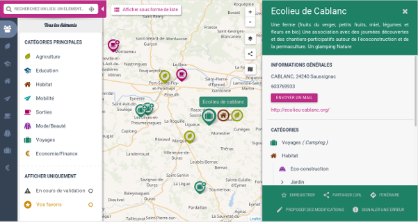

Overview
==========
A javascript component to create terrific cartography ! GoGoCartoJs is the autonomous frontend part of the [GoGoCarto Project](https://github.com/pixelhumain/GoGoCarto)


.   .   


Demo
-----

[Try it Now!](web/examples)


Download
--------

[Download Latest Release](https://github.com/pixelhumain/GoGoCartoJs/releases)

Overview
--------

GoGoCartoJs is fast, ergonomic, responsive and fully configurable. 

It can be instanciated in few lines from a DOM element, a taxonomy (i.e. filters/categories) and a dataset (distant or local). Both taxonomy and data need to be JSON objects.

```javascript
carto = goGoCarto('#gogocarto', {
  data: {
      taxonomy: "http://test.com/api/taxonomy",
      elementsApiUrl: 'https://test.com/api/dataset'
  });
```

Know more about [Usage](docs/usage.md), [Features](docs/features.md) and [Configuration](docs/configuration.md)


Stack
-----
Typescript, Nunjucks templates, Leaflet, SASS, MaterializeCSS, Gulp


Want to Contribute ?
-------------

1. [Installation intructions](docs/how-to-contribute/1-Installation.md)
2. [Coding conventions](docs/how-to-contribute/2-Coding-conventions.md)
3. [Code Explanations](docs/how-to-contribute/3-Code-explanations.md)
4. [UI Layout](docs/how-to-contribute/4-Ui-layout.md)
5. [Application state machine](docs/how-to-contribute/5-App-state-mode.md)
6. [Application main behaviour](docs/how-to-contribute/6-App-main-behaviour.md)
